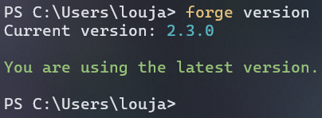
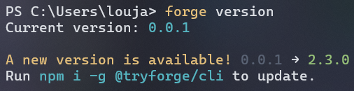

### 📦 `forge version`

Displays the currently installed version of ForgeCLI and checks if a newer version is available on npm.

---

#### 🔧 Usage

```bash
forge version
```

---

#### 🖥 Output Example



If a new version is available:



---

#### 📚 Description

The `version` command checks:

* Your currently installed version of ForgeCLI
* The latest available version from the [npm registry](https://www.npmjs.com/package/@tryforge/cli)
* If a newer version is available, it suggests a simple update command

---

#### 🔎 Flags

No flags currently. It’s a simple, straightforward command.